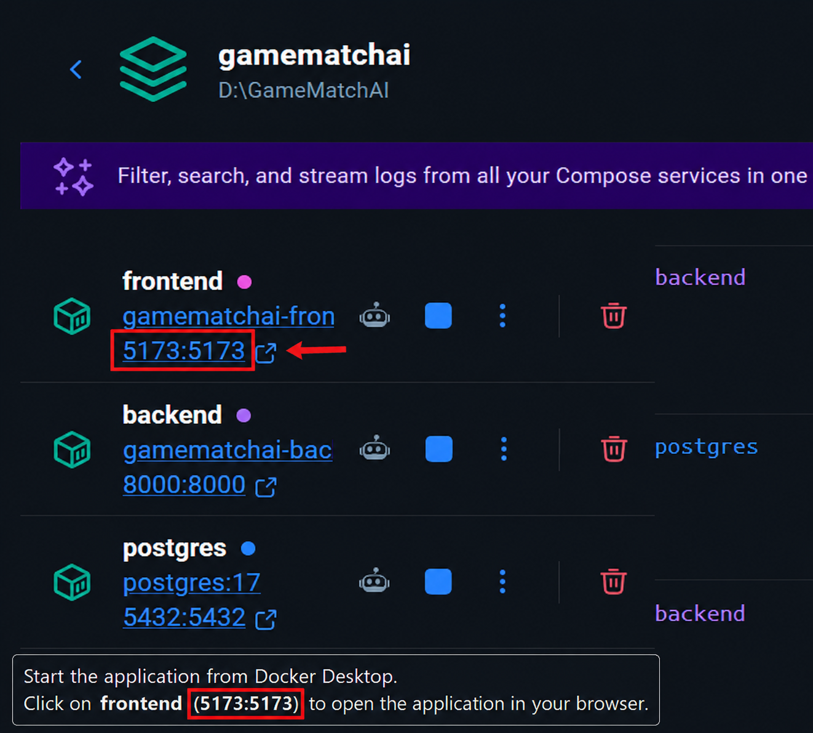
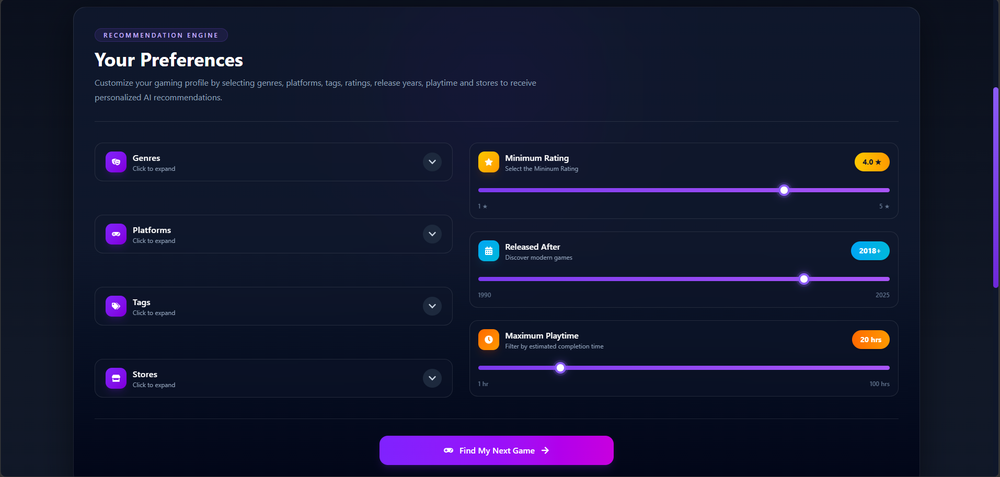
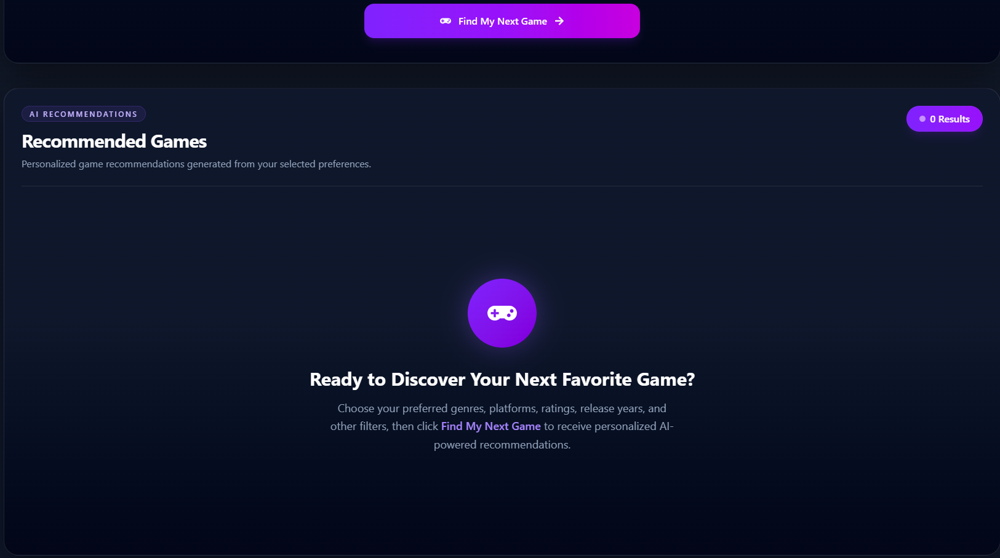
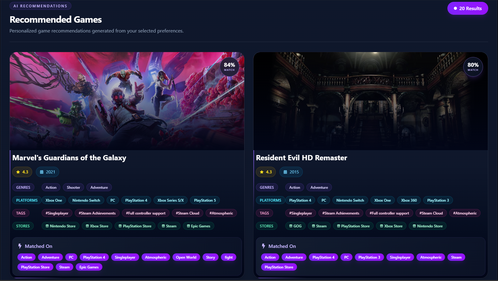
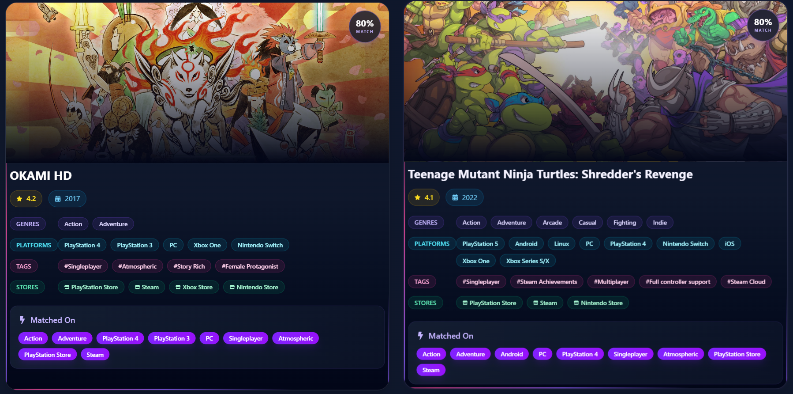
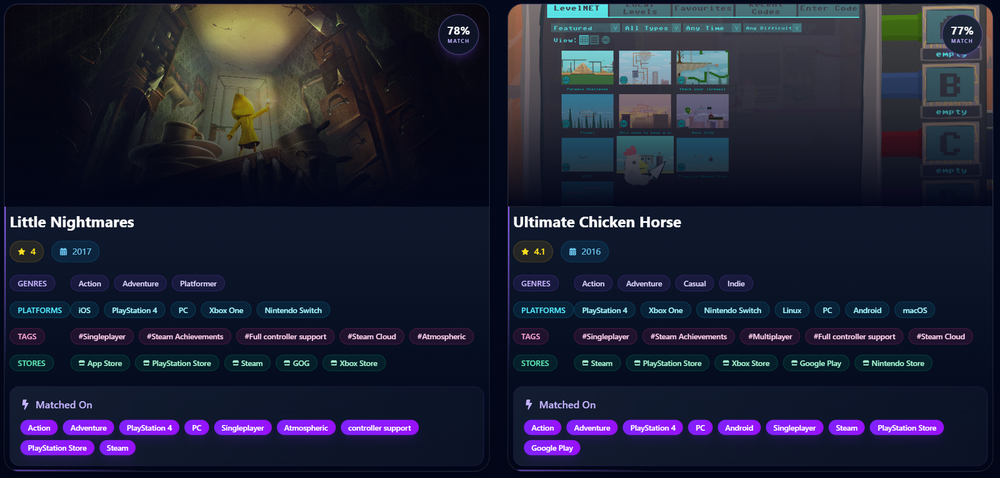

# User Guide

## Overview

This document explains how to use **GameMatch AI** after it has been installed successfully.

GameMatch AI is a personalized video game recommendation system that helps users discover games based on their individual preferences. Instead of browsing through hundreds of games manually, users can select their preferred genres, platforms, gameplay tags, digital stores, minimum rating, release year, and maximum playtime to receive personalized recommendations.

The recommendation engine evaluates each game using a custom weighted scoring algorithm and returns the highest-ranked games from the local PostgreSQL database.

This guide explains how to:

- Start the application.
- Open the GameMatch AI website.
- Select game preferences.
- Generate personalized recommendations.
- Understand the recommendation score.
- Interpret the recommendation cards.
- Stop the application safely.

## Application Interface

After starting the application, the GameMatch AI homepage will open in your web browser.

The interface is designed to be simple, modern, and easy to use. It is divided into three main sections:

### 1. Hero Section

The top section introduces the application and briefly explains its purpose. It also includes a featured game image to create an engaging first impression.

---

### 2. Preference Selection Panel

This is the main area where users customize their game preferences before generating recommendations.

Users can select:

- **Genres** – Choose one or more game genres (e.g., Action, Adventure, RPG).
- **Platforms** – Select preferred gaming platforms such as PC, PlayStation, or Xbox.
- **Tags** – Choose gameplay characteristics such as Open World, Story Rich, Multiplayer, etc.
- **Minimum Rating** – Set the minimum acceptable game rating using the slider.
- **Released After** – Filter games released after a selected year.
- **Maximum Playtime** – Specify the maximum estimated playtime.
- **Stores** – Select preferred digital stores such as Steam, Epic Games Store, or PlayStation Store.

Each filter can be adjusted independently, allowing users to personalize their recommendations according to their interests.

---

### 3. Recommendation Button

After selecting the desired preferences, click the **Find My Next Game** button.

The selected preferences are sent to the FastAPI backend, where the recommendation engine evaluates every game in the PostgreSQL database using the weighted scoring algorithm.

The highest-scoring games are then returned and displayed as personalized recommendations.

> **Note:** Users do not need to fill every filter. Recommendations can be generated using as few or as many preferences as desired.

### Genre Selection

The **Genres** filter allows users to select one or more game genres based on their interests. Selecting multiple genres helps the recommendation engine identify games that best match the user's preferred gameplay style.

### Platform Selection

The **Platforms** filter allows users to choose one or more gaming platforms on which they want to play. This ensures that only games available on the selected platforms are prioritized in the recommendations.

### Tag Selection

The **Tags** filter allows users to select gameplay characteristics such as **Open World**, **Singleplayer**, or **Story Rich**. A search bar is also provided to quickly find specific tags, making it easier to personalize game recommendations.

### Store Selection

The **Stores** filter allows users to select one or more digital game stores, such as **Steam**, **PlayStation Store**, or **Xbox Store**. This helps prioritize games that are available on the user's preferred platforms for purchase or download.

### Minimum Rating

The **Minimum Rating** slider allows users to set the lowest acceptable game rating. Games with ratings below the selected value receive a lower recommendation score or may be filtered out during the recommendation process.

---

### Released After

The **Released After** slider allows users to specify the earliest release year for recommended games. This helps users discover newer titles while excluding older releases that do not meet their preference.

---

### Maximum Playtime

The **Maximum Playtime** slider allows users to define the maximum estimated completion time for a game. This enables users to find games that fit their available time, whether they prefer shorter experiences or longer adventures.

### Generate Recommendations

After selecting the desired preferences, click the **Find My Next Game** button to generate personalized game recommendations.

The recommendation engine processes the selected filters, calculates a match score for every eligible game, and displays the highest-ranked results in the **Recommended Games** section. If no preferences have been selected yet, the application displays a placeholder message prompting the user to choose their preferences before generating recommendations.

### Viewing Recommendation Results

After the recommendation process is complete, the **Recommended Games** section displays the 20 highest-ranked games based on the selected preferences.

Each recommendation card includes:

- **Match Score** – Indicates how closely the game matches the selected preferences.
- **Game Cover Image** – Displays the game's artwork.
- **Game Title** – Name of the recommended game.
- **Rating** – Average user rating of the game.
- **Release Year** – Year the game was released.
- **Genres** – Categories the game belongs to.
- **Platforms** – Platforms on which the game is available.
- **Tags** – Gameplay characteristics and features.
- **Stores** – Digital stores where the game can be purchased or downloaded.
- **Matched On** – Highlights the specific user preferences that contributed to the recommendation score.

